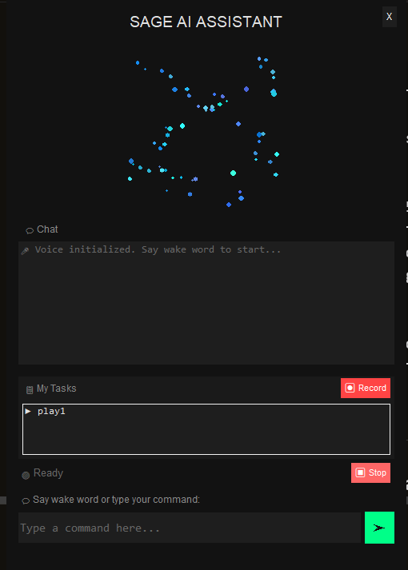

<div align="center">

# 🧠 SAGE - Smart AI Desktop Assistant

### Your Intelligent Voice-Controlled Desktop Companion

[](https://python.org)
[](https://www.microsoft.com/windows)
[](LICENSE)
[](https://groq.com)

**SAGE** (Smart AI General-purpose Engine) is an intelligent desktop assistant that combines voice commands, AI orchestration, and automation to help you control your computer hands-free.

[Features](#-features) • [Demo](#-demo) • [Installation](#-installation) • [Usage](#-usage) • [API Keys](#-api-keys-setup)

</div>

---

## 🎬 Demo

<!-- Add your demo video here -->
<!-- Option 1: YouTube embed -->
<!-- [](https://www.youtube.com/watch?v=YOUR_VIDEO_ID) -->

<!-- Option 2: GIF demo -->
<!--  -->

> 📹 **Demo video coming soon!** Record a video showing SAGE in action and add it here.

---

## 📸 Screenshots

<div align="center">



*SAGE Particle UI with voice control and text input*

</div>

---

## ✨ Features

<table>
<tr>
<td width="50%">

### 🎤 Voice Control
- **Wake Word Detection** - Say "Hey SAGE" to activate
- **Natural Language Processing** - Speak naturally
- **Text-to-Speech Responses** - SAGE talks back
- **Continuous Listening** - Always ready to help

### 🤖 AI-Powered Orchestration
- **Smart Task Planning** - Breaks complex tasks into steps
- **Automatic Tool Selection** - Picks the right tool for the job
- **Multi-Step Workflows** - Chains actions together
- **Real-time Progress Display** - See what SAGE is thinking

### 💬 Dual Input Mode
- **Voice Commands** - Hands-free operation
- **Text Input** - Type commands directly in the UI
- **Hybrid Mode** - Switch seamlessly between both

</td>
<td width="50%">

### 📧 Communication
- **Email** - Send emails via Gmail (browser-based)
- **WhatsApp** - Messages, voice calls, video calls
- **Smart Contacts** - Contact database with lookup
- **Templates** - Pre-built email templates

### 🔧 System Control
- **App Control** - Open/close any application
- **Volume & Brightness** - Adjust system settings
- **Power Management** - Lock, sleep, shutdown
- **Text Typing** - Type anywhere on screen

### 📅 Productivity
- **Meeting Scheduler** - Google Meet + Calendar
- **Calculator** - Math calculations
- **Web Search** - Quick searches
- **File Search** - Find files in Downloads

</td>
</tr>
</table>

### 🎯 More Features

| Feature | Description |
|---------|-------------|
| 🎵 **Spotify Control** | Play songs, skip tracks, control playback |
| 📝 **Content Generation** | Create documents, emails, invitations with AI |
| 👁️ **Screen Analysis** | AI vision to understand what's on screen |
| 🔄 **Task Recording** | Record and replay mouse/keyboard actions |
| ⚡ **Auto Tool Generation** | Creates new automation tools on-demand |

---

## 🏗️ Architecture

```
┌─────────────────────────────────────────────────────────────────┐
│                         SAGE Architecture                        │
├─────────────────────────────────────────────────────────────────┤
│                                                                  │
│   ┌──────────┐    ┌──────────────┐    ┌──────────────────────┐  │
│   │  Voice   │───▶│ Orchestrator │───▶│       Tools          │  │
│   │  Input   │    │  (Groq AI)   │    │                      │  │
│   └──────────┘    └──────────────┘    │  • System Control    │  │
│        │                │             │  • Communication     │  │
│        ▼                ▼             │  • Productivity      │  │
│   ┌──────────┐    ┌──────────────┐    │  • Media Control     │  │
│   │   Text   │    │    Code      │    │  • AI Tools          │  │
│   │  Input   │    │  Generator   │    └──────────────────────┘  │
│   └──────────┘    │ (OpenRouter) │              │               │
│                   └──────────────┘              ▼               │
│                                         ┌──────────────┐        │
│                                         │   Response   │        │
│                                         │  (TTS + UI)  │        │
│                                         └──────────────┘        │
└─────────────────────────────────────────────────────────────────┘
```

---

## 🚀 Installation

### Prerequisites
- **Python 3.10+**
- **Windows 10/11**
- **Microphone** (for voice commands)

### Quick Start

```bash
# 1. Clone the repository
git clone https://github.com/yourusername/sage.git
cd sage

# 2. Create virtual environment
python -m venv venv
venv\Scripts\activate

# 3. Install dependencies
pip install -r requirements.txt

# 4. Configure API keys (see below)
cp .env.example .env
# Edit .env with your API keys

# 5. Run SAGE
python main.py
```

---

## 🔑 API Keys Setup

SAGE requires API keys to function. All keys have **free tiers** available.

### Required Keys

| Service | Purpose | Get Key | Free Tier |
|---------|---------|---------|-----------|
| **Groq** | Main AI (Llama 3.3 70B) | [console.groq.com](https://console.groq.com/) | ✅ Yes |
| **Picovoice** | Wake word detection | [console.picovoice.ai](https://console.picovoice.ai/) | ✅ Yes |

### Optional Keys (Enhanced Features)

| Service | Purpose | Get Key | Free Tier |
|---------|---------|---------|-----------|
| **OpenRouter** | Code generation, Screen analysis | [openrouter.ai](https://openrouter.ai/) | ✅ Limited |
| **Gemini** | Fallback AI provider | [aistudio.google.com](https://aistudio.google.com/app/apikey) | ✅ Yes |

### Configuration

1. Copy the example file:
   ```bash
   cp .env.example .env
   ```

2. Edit `.env` and add your keys:
   ```env
   GROQ_API_KEY=your_groq_key_here
   PICOVOICE_ACCESS_KEY=your_picovoice_key_here
   OPENROUTER_API_KEY=your_openrouter_key_here  # Optional
   ```

---

## 🎮 Usage

### Starting SAGE

```bash
python main.py
```

### Voice Commands

Simply say **"Hey SAGE"** followed by your command:

| Category | Example Commands |
|----------|------------------|
| **Apps** | "Open Chrome", "Close Notepad", "Open Spotify" |
| **System** | "Set volume to 50", "Lock the screen", "What time is it" |
| **Email** | "Send email to manager about sick leave" |
| **WhatsApp** | "Send WhatsApp to John saying hello" |
| **Meetings** | "Schedule meeting with Sarah tomorrow at 3 PM" |
| **Music** | "Play Shape of You on Spotify", "Next song" |
| **Math** | "What is 25 times 4", "Calculate 100 divided by 7" |
| **Search** | "Search downloads for PDF files" |
| **Content** | "Write a birthday invitation for Saturday" |

### Text Input

You can also type commands directly in the input box at the bottom of the UI.

---

## 🤖 AI Models

| Component | Model | Provider | Purpose |
|-----------|-------|----------|---------|
| **Orchestrator** | Llama 3.3 70B | Groq | Task planning & execution |
| **Code Generator** | Qwen 2.5 Coder 32B | OpenRouter | Auto-generate tools |
| **Screen Analyzer** | Qwen 2.5 VL 72B | OpenRouter | Vision analysis |
| **Content Generator** | Llama 3.3 70B | Groq | Documents & emails |

---

## 📁 Project Structure

```
sage/
├── main.py                 # Entry point
├── config/                 # Configuration
│   ├── settings.py         # Settings management
│   └── api_keys.py         # API key handling
├── core/                   # Core AI logic
│   ├── orchestrator.py     # Main AI orchestrator
│   ├── task_executor.py    # Task execution
│   ├── code_generator.py   # Auto tool generation
│   └── intent_parser.py    # Intent classification
├── tools/                  # All automation tools
│   ├── system/             # System control
│   ├── productivity/       # Productivity tools
│   ├── communication/      # Email, WhatsApp
│   ├── media/              # Spotify control
│   └── ai/                 # AI-powered tools
├── voice/                  # Voice modules
│   ├── wake_word.py        # Wake word detection
│   ├── speech_to_text.py   # Speech recognition
│   └── tts.py              # Text-to-speech
├── ui/                     # User interface
│   └── particle_window.py  # Main GUI
├── data/                   # Data files
│   └── contacts.json       # Contact database
├── tests/                  # Test files
└── examples/               # Demo scripts
```

---

## 🛠️ Development

### Running Tests

```bash
# Run all tests
python -m pytest tests/

# Run specific test
python tests/test_all_functionalities.py
```

### Adding New Tools

1. Create a new file in `tools/<category>/`
2. Define your function with proper docstring
3. Register it in `core/orchestrator.py`

See [CONTRIBUTING.md](CONTRIBUTING.md) for detailed guidelines.

---

## 📋 Requirements

```
groq>=0.4.0
requests>=2.31.0
python-dotenv>=1.0.0
pvporcupine>=3.0.0
speechrecognition>=3.10.0
pyttsx3>=2.90
pyaudio>=0.2.13
pyautogui>=0.9.54
pyperclip>=1.8.2
pynput>=1.7.6
Pillow>=10.0.0
```

---

## 🤝 Contributing

Contributions are welcome! Please read [CONTRIBUTING.md](CONTRIBUTING.md) for guidelines.

1. Fork the repository
2. Create your feature branch (`git checkout -b feature/amazing-feature`)
3. Commit your changes (`git commit -m 'Add amazing feature'`)
4. Push to the branch (`git push origin feature/amazing-feature`)
5. Open a Pull Request

---

## 📄 License

This project is licensed under the MIT License - see the [LICENSE](LICENSE) file for details.

---

## 🙏 Acknowledgments

- [Groq](https://groq.com/) - Fast AI inference
- [Picovoice](https://picovoice.ai/) - Wake word detection
- [OpenRouter](https://openrouter.ai/) - AI model routing
- [PyAutoGUI](https://pyautogui.readthedocs.io/) - Desktop automation

---

<div align="center">

**Made by Parth **

⭐ Star this repo if you find it useful!

</div>
